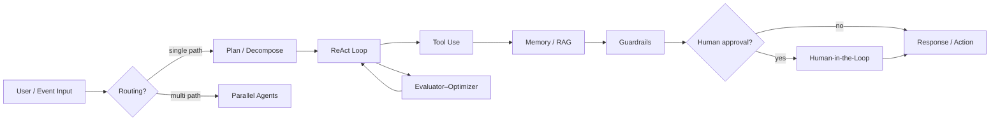

> **English** | [বাংলা](../bn/architecture/overview.md)

# Project Architecture

## Layout

```
agentic-ai-overview/
├── docs/                    # Reference documentation
│   ├── patterns/            # Pattern catalog & index
│   └── architecture/        # This file — project conventions
├── patterns/                # One folder per design pattern
│   └── XX-pattern-name/
│       ├── README.md        # Pattern definition & when to use it
│       ├── use-case.md      # Real-life scenario (you fill this in)
│       └── example/         # Runnable implementation
├── shared/                  # Reusable code across examples
│   ├── config/              # Shared configuration helpers
│   ├── examples/            # Scenario tools, CLI, tool_provider
│   ├── mcp/                 # Optional MCP server + client (--use-mcp)
│   └── utils/               # Logging, LLM clients, common helpers
├── templates/               # Scaffolds for new pattern examples
└── README.md                # Project entry point
```

## Conventions

### Pattern folders

- Prefix with a two-digit number for stable ordering (`01-react`, not `react`).
- Use kebab-case for folder names.
- Every pattern folder must contain at least:
  - `README.md` — what the pattern is and when to use it
  - `use-case.md` — real-world problem statement (placeholder until you implement)
  - `example/` — code, prompts, or config for a minimal demo

### Example implementations

- Keep each example **self-contained** under its pattern's `example/` directory.
- Prefer pulling shared logic from `shared/` rather than duplicating across patterns.
- Document prerequisites, env vars, and run instructions in `example/README.md`.

### Shared code

- Put cross-cutting utilities in `shared/utils/` (e.g. LLM wrapper, structured logging).
- Put environment and model defaults in `shared/config/`.
- Do not put pattern-specific logic in `shared/` — keep it generic.

## Single-agent vs multi-agent

See [single-vs-multi-agent.md](single-vs-multi-agent.md) for definitions, when to choose each, and which patterns map to single-agent, multi-agent, or both.

## Framework

All runnable examples use **[LangGraph](langgraph.md)**. Shared LLM and env helpers live in [`shared/`](../../shared/).

Optional **[MCP tool transport](mcp.md)** (`--use-mcp`) exposes the same scenario tools over stdio instead of in-process imports.

## Typical Agent Flow (mental model)



Not every pattern appears in every system; this diagram shows how patterns often compose.
