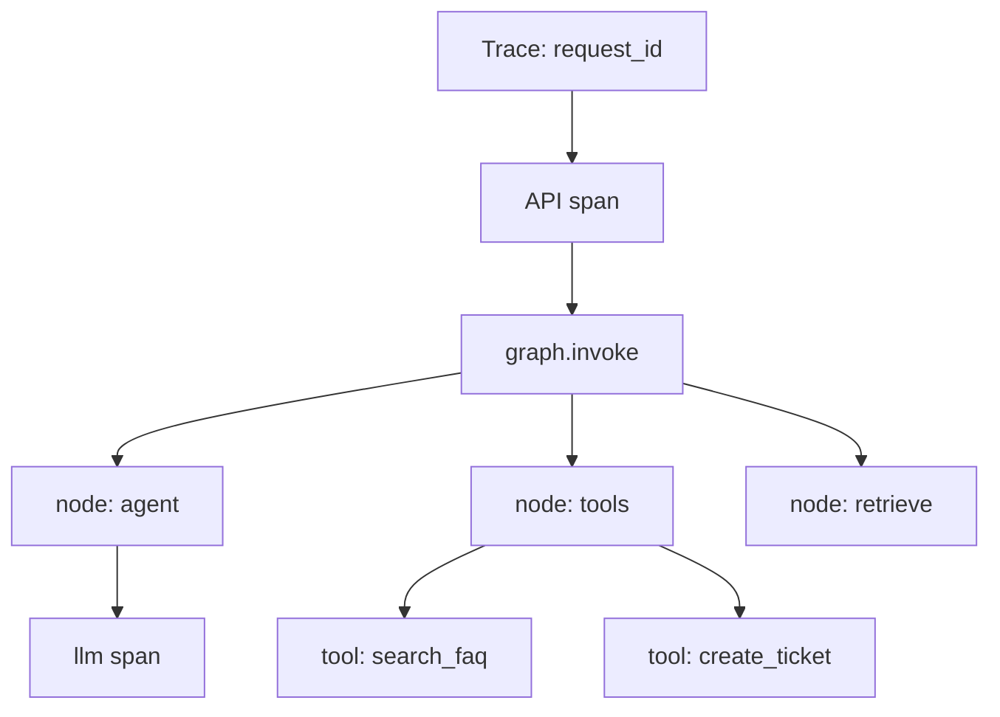

# Observability and evals

Operating agent systems requires **visibility into each step** and **offline quality checks** — extending pattern [08 Evaluator–Optimizer](../../patterns/08-evaluator-optimizer/) from demo loop to production discipline.

**Related:** [production concerns](production-concerns.md) · [reference architecture](reference-architecture.md)

---

## Three layers

| Layer | Question | Tools (examples) |
|-------|----------|------------------|
| **Logs** | What happened? | Structured JSON logs, audit table |
| **Traces** | Where did time go? | OpenTelemetry, LangSmith, Langfuse |
| **Evals** | Is quality good enough to ship? | Dataset + scorer + CI gate |

This repo prints graph output to CLI — production exports the same events to your observability stack.

---

## What to trace



| Span | Attributes |
|------|------------|
| `graph.invoke` | `thread_id`, `scenario`, `pattern`, `provider` |
| `node.*` | node name, duration, error |
| `llm.chat` | model, input/output tokens, finish reason |
| `tool.*` | tool name, success, latency (not secrets in args) |
| `hitl.interrupt` | pending action type |

LangGraph [streaming](../../patterns/01-react/example/) and [event streaming](../../patterns/07-orchestrator-workers/example/) (`stream_mode="updates"`) mirror what you would stream to a UI or log aggregator.

---

## Metrics (SLIs)

| Metric | Why |
|--------|-----|
| **P95 latency** end-to-end | User experience |
| **Tokens per successful task** | Cost |
| **Tool error rate** | Integration health |
| **HITL pending time** | Ops bottleneck |
| **Guardrail block rate** | Policy or attack signal |
| **ReAct iterations per thread** | Loop runaway detection |

Alert on iteration count and token spikes — often the first sign of a bad deploy or prompt regression.

---

## Logging vs tracing

| Use logging for | Use tracing for |
|-----------------|-----------------|
| Audit (who approved refund) | Latency breakdown |
| Business events (ticket created) | Cross-service request flow |
| Security blocks | LLM + tool parent-child spans |

Use one **correlation id** (`request_id` / `trace_id`) across both — see [production concerns](production-concerns.md#audit-logging).

---

## Offline evaluation

Pattern 08 runs **online** evaluate-revise loops. Production also needs **offline** evals before release:

| Eval type | Dataset | Scorer |
|-----------|---------|--------|
| **Tool selection** | User message → expected tool(s) | Exact or fuzzy match |
| **Grounded QA** | Question + gold doc ids | Retrieval recall, citation match |
| **Policy compliance** | Adversarial prompts | Guardrail should block |
| **End-to-end** | Full conversations | LLM-judge rubric + human spot-check |

### Minimal eval pipeline

```
Fixtures (JSON)  →  run graph (no API in CI: mock LLM)  →  scorer  →  pass/fail gate
```

This repo’s [tests/](../../../tests/) cover tools, CLI, orchestrator parsing — extend with golden conversations per scenario.

### Online vs offline 08

| | Offline eval | Online 08 loop |
|--|--------------|----------------|
| **When** | Pre-deploy CI | Each user request (optional) |
| **Cost** | Batch, controlled | Extra LLM calls |
| **Use** | Regression gate | Polish high-value responses |

Do not run unbounded 08 loops on every production message unless latency and cost allow it.

---

## Evals by scenario

| Scenario | Priority evals |
|----------|----------------|
| helpdesk | Correct FAQ citation; no PII in ticket; VPN route accuracy |
| ecommerce | Order id handling; refund policy grounding; HITL on refund |
| demand-forecast | Tool sequence for MLDLC; mock MLflow metrics logged |

Pull sample prompts from [use-case docs](../../use-cases/it-helpdesk.md) extended flows.

---

## Debugging workflows

| Symptom | Check |
|---------|-------|
| Wrong answer | Retrieve chunks (RAG), tool outputs, message history |
| Slow | Trace span durations; parallel fan-out ([06](../../patterns/06-parallelization/)) |
| Duplicate tickets | Idempotency keys ([production concerns](production-concerns.md)) |
| Stuck conversation | Checkpointer state, pending HITL ([09](../../patterns/09-human-in-the-loop/) `--time-travel`) |

Repo: `python patterns/09-human-in-the-loop/example/main.py --auto-approve --time-travel`

---

## What this repo does not include

- LangSmith / Langfuse wiring (add in your API layer)
- Hosted eval dashboards
- Continuous production sampling

Hook traces at the `graph.invoke` wrapper when you add an HTTP API.

---

## Checklist

- [ ] Trace id on every request
- [ ] Spans for LLM, tools, retrieve, HITL
- [ ] Token and iteration metrics
- [ ] Audit log for write tools
- [ ] Golden eval set per scenario in CI (mock LLM)
- [ ] Optional online 08 for high-value paths only

---

## Next steps

- [Scenario deployments](scenario-deployments.md) — domain-specific SLIs
- [RAG at scale](rag-at-scale.md) — retrieval eval metrics
