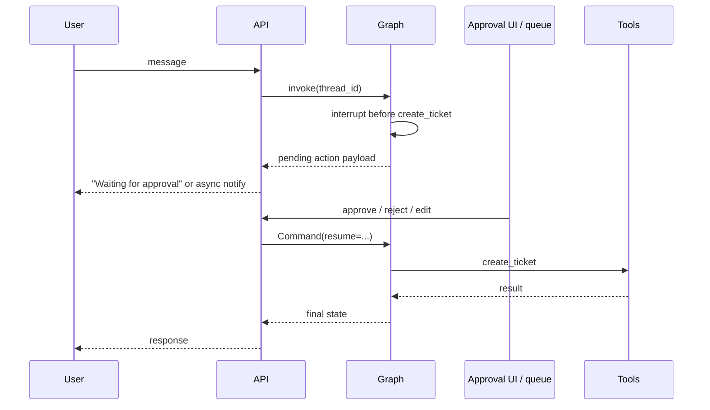

# Production concerns

Reliability, safety, and operability patterns for **deployed** agent systems — beyond what runnable CLI examples need to demonstrate.

**Related:** [reference architecture](reference-architecture.md) · [09 HITL](../../patterns/09-human-in-the-loop/) · [12 Guardrails](../../patterns/12-guardrails/)

---

## Timeouts and budgets

Agents loop; unbounded loops burn cost and block users.

| Layer | Recommendation | Maps to repo |
|-------|----------------|--------------|
| **HTTP request** | 30–120s for sync chat; return job ID for long work | Add API wrapper around `graph.invoke` |
| **LLM call** | Per-call timeout (e.g. 60s) | `shared/utils/llm.py` clients |
| **Tool call** | Shorter timeout per tool (5–30s) | Scenario tools today are instant mocks |
| **Graph steps** | Max ReAct iterations (e.g. 10–25) | Pattern 07 uses round limits in orchestrator |
| **Whole graph** | Max wall-clock or max node visits | Configure in graph or wrapper |

**Pattern 07 lesson:** Workers run full ReAct loops with round limits — apply the same cap to single-agent ReAct in production.

Expose timeouts in config (env or settings), not hard-coded in graph nodes.

---

## Retries

| Retry? | Target | Strategy |
|--------|--------|----------|
| Yes (with backoff) | LLM 429/5xx, transient network | Idempotent read tools only on auto-retry |
| Careful | Tool calls with side effects | Retry only if tool is idempotent |
| No | User-facing final answer after partial state | Surface error; use checkpoint to resume |

**LangGraph:** Persist state before side-effect tools ([09 HITL](../../patterns/09-human-in-the-loop/)) so retries do not double-charge or double-ticket.

---

## Idempotent tools

Side-effect tools (`create_ticket`, `request_refund`, `register_model`) must be safe under **at-least-once** delivery (queues, client retries).

| Technique | Example |
|-----------|---------|
| **Idempotency key** | Client sends `Idempotency-Key: uuid`; tool checks store before create |
| **Natural idempotency** | `update_shipping_address(order_id, addr)` with same payload |
| **Outbox pattern** | Graph decides action; separate worker executes once |

Pattern [15 Event-Driven](../../patterns/15-event-driven/) consumers should dedupe by `event_id`.

---

## Human-in-the-loop in production

CLI uses `--auto-approve`. Production needs an **approval surface**:

| Requirement | Detail |
|-------------|--------|
| **Payload at interrupt** | Tool name, args, human-readable summary, risk level |
| **SLA** | Escalate if no approver within N minutes |
| **Audit** | Who approved, when, original vs edited args |
| **Resume** | Same `thread_id` + checkpointer ([09 example](../../patterns/09-human-in-the-loop/example/)) |

Demand-forecast: HITL on `register_model` before production registry — see [scenario deployments](scenario-deployments.md#demand-forecast-ml-pipeline).

---

## Guardrails in depth

Pattern [12](../../patterns/12-guardrails/) blocks PII in examples. Production stacks layers:

| Layer | When | Example |
|-------|------|---------|
| **Input filter** | Before graph | Block SSN, credit card patterns |
| **Tool arg validation** | Before execute | Schema + allowlist of ticket categories |
| **Output filter** | Before user | Redact secrets leaked in model text |
| **Policy engine** | High risk | Separate service; graph calls `check_policy` tool |

Guardrails should **fail closed** for regulated actions (no ticket, no refund) and log violations for review.

---

## Authentication and authorization

| Actor | Access |
|-------|--------|
| End user | Own orders / own tickets only — pass identity into graph state |
| Agent tools | Service account with least privilege |
| Approvers | Role-based; separate from chat user |
| MCP servers | Scoped tool lists per scenario ([MCP](../mcp.md)) |

Mock scenarios use fixed personas (Alex Jordan, Jordan Lee) — replace with real auth context in `graph` state.

---

## Audit logging

Append-only log for compliance and debugging:

| Event | Fields |
|-------|--------|
| `graph.start` | `thread_id`, user_id, scenario, model |
| `llm.call` | model, token usage (not full prompt in prod if sensitive) |
| `tool.call` | tool name, args hash, result status, latency |
| `hitl.pending` | action summary, approver queue |
| `hitl.resolved` | approver_id, decision |
| `guardrail.block` | rule id, reason |

Correlate with **trace id** — see [observability & evals](observability-and-evals.md).

---

## Secrets and config

- API keys in secret manager, loaded at runtime — not in prompts or logs.
- `.env` is for local dev only ([`.env.example`](../../../.env.example)).
- Separate keys per environment; rotate LLM keys independently of tool credentials.

---

## Rate limiting and cost

| Knob | Purpose |
|------|---------|
| Per-user RPM | Abuse prevention |
| Per-tenant token budget | Cost cap |
| Model routing | Cheap model for classify/route ([05 Routing](../../patterns/05-routing/)); expensive for final answer |
| Cache | Embeddings, frequent FAQ retrieval |

Pattern [06 Parallelization](../../patterns/06-parallelization/) multiplies LLM calls — cap parallel fan-out in production.

---

## Deployment checklist

Before production traffic:

- [ ] Timeouts on LLM, tools, and graph
- [ ] Checkpointer on durable DB (not ephemeral SQLite)
- [ ] Idempotency on all write tools
- [ ] HITL wired for destructive actions
- [ ] Guardrails on input, tools, output
- [ ] Audit log + trace id
- [ ] Rate limits and cost alerts
- [ ] DLQ for event-driven paths ([15](../../patterns/15-event-driven/))

---

## Next steps

- [Observability & evals](observability-and-evals.md) — traces and quality gates
- [RAG at scale](rag-at-scale.md) — if KB is central to your system
