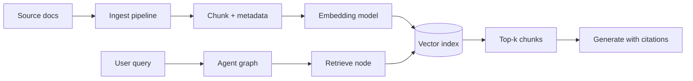

# RAG at scale

How to design **retrieval** for production agents — extending pattern [11 RAG](../../patterns/11-rag/) and the markdown KBs in `shared/examples/*/data/kb/`.

**Related:** [reference architecture](reference-architecture.md) · [11-rag example](../../patterns/11-rag/example/)

---

## RAG vs tool search vs prompt-only

| Approach | Best for | Repo example |
|----------|----------|--------------|
| **Prompt-only** | Small, static facts | Hard-coded FAQ dict (early 01–02) |
| **RAG retrieve node** | Policies, playbooks, long docs | [11-rag](../../patterns/11-rag/), KB markdown |
| **Search tool** | Live queries, filters, pagination | `search_faq`, `search_policies` tools |
| **Hybrid** | Production support bots | Retrieve + tool for live status |

Use **RAG** when answers must cite internal docs that change independently of code. Use **tools** when data is transactional (order status, VPN gateway state).

---

## Architecture



| Stage | Production concern |
|-------|-------------------|
| **Ingest** | Scheduled sync from Confluence, S3, git |
| **Chunk** | Size, overlap, preserve headings |
| **Metadata** | `source`, `version`, `acl`, `scenario` |
| **Embed** | Model version pinned; re-embed on model change |
| **Index** | Per-tenant or per-scenario collections |

This repo loads markdown from disk — production swaps the retrieve node for your vector store client.

---

## Chunking guidelines

| Doc type | Chunk strategy |
|----------|----------------|
| IT policies | By heading section; keep numbered steps intact |
| E-commerce returns | One policy section per chunk; attach `policy_id` |
| ML playbooks | Procedure blocks; link to tool names in metadata |

**Overlap:** 10–20% reduces boundary cuts mid-sentence.

**Avoid:** Chunks with no context ( orphan bullets ) — prepend title path in chunk text.

---

## Retrieval quality

| Technique | When |
|-----------|------|
| **Top-k** (k=3–8) | Default starting point |
| **MMR** | Reduce duplicate chunks |
| **Metadata filter** | `scenario=helpdesk`, user locale, ACL |
| **Re-ranker** | High-stakes answers (legal, medical boundaries) |
| **Query rewrite** | Multi-turn — use [10 Memory](../../patterns/10-memory/) thread + last user message |

Pattern [08 Evaluator–Optimizer](../../patterns/08-evaluator-optimizer/) can score grounded answers (citation match, hallucination flags).

---

## Freshness and versioning

| Problem | Mitigation |
|---------|------------|
| Stale policy | Version in metadata; show “effective date” in citations |
| Index lag | Ingest webhook on doc publish; TTL alert if index > N hours old |
| Wrong doc set | Separate indexes per scenario — do not mix helpdesk and ecommerce KB |

Regenerate synthetic data locally:

```bash
python shared/examples/demand_forecast/data/generate_data.py
```

Production equivalent: CI job that validates KB + re-indexes staging before prod.

---

## Security

- **ACL at retrieve time:** Filter vectors by user’s groups — not just obfuscate in prompt.
- **No secrets in KB:** Guardrails ([12](../../patterns/12-guardrails/)) still required; RAG can retrieve internal URLs or tokens if docs are messy.
- **Prompt injection via docs:** Treat retrieved text as untrusted; instruct model not to follow instructions embedded in docs.

---

## When not to use RAG

- Answer needs **live** data only (order tracking) — use tools.
- Entire KB fits in context reliably — prompt caching may be cheaper.
- Retrieval quality is poor without investment — fix indexing before shipping.

---

## Mapping to scenarios

| Scenario | KB location | Typical queries |
|----------|---------------|-----------------|
| helpdesk | `shared/examples/helpdesk/data/kb/` | VPN, password, Outlook |
| ecommerce | `shared/examples/ecommerce/data/kb/` | Shipping, returns |
| demand-forecast | `shared/examples/demand_forecast/data/kb/` | MAPE, features, retrain policy |

See [scenario deployments](scenario-deployments.md) for full system context.

---

## Implementation path from this repo

1. Run [11-rag example](../../patterns/11-rag/example/) with `--scenario helpdesk`.
2. Replace in-memory retrieval with your vector DB in the retrieve node only.
3. Add ingest job for your real doc source.
4. Add eval set (see [observability & evals](observability-and-evals.md)) with expected citations.

---

## Next steps

- [Observability & evals](observability-and-evals.md) — measure retrieval precision
- [Production concerns](production-concerns.md) — ACL, audit, timeouts on retrieve
