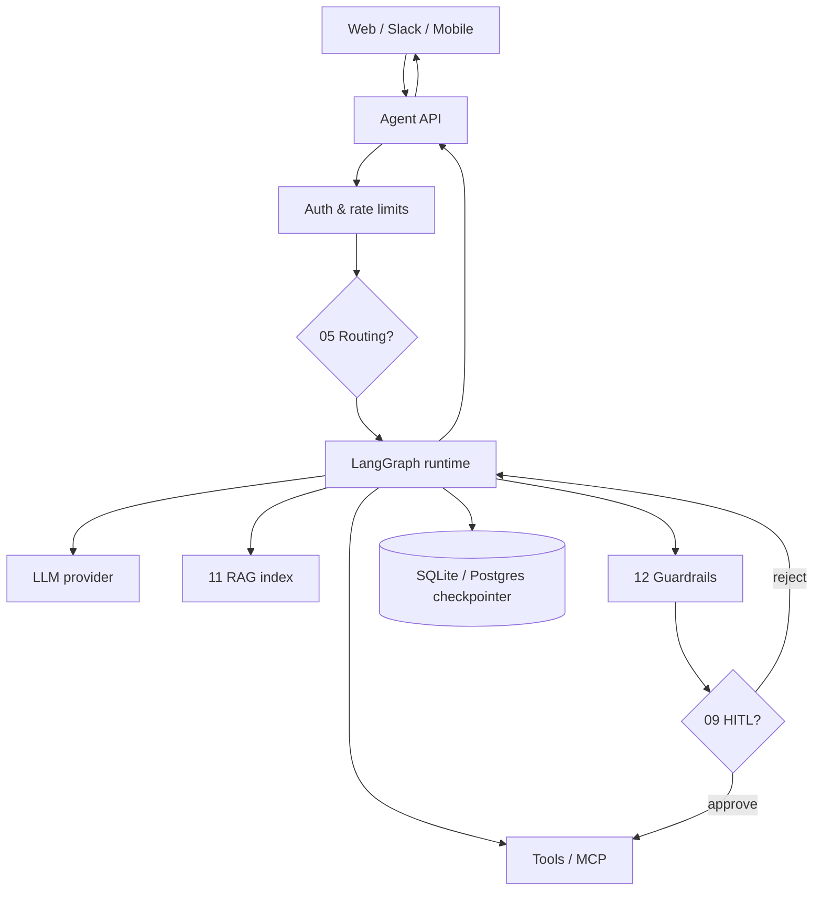
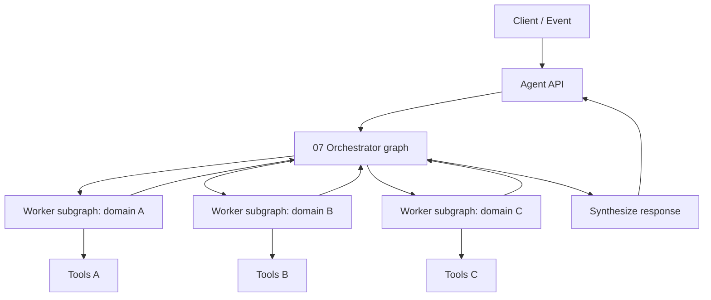
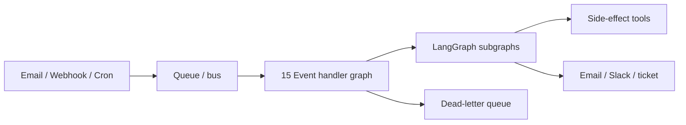
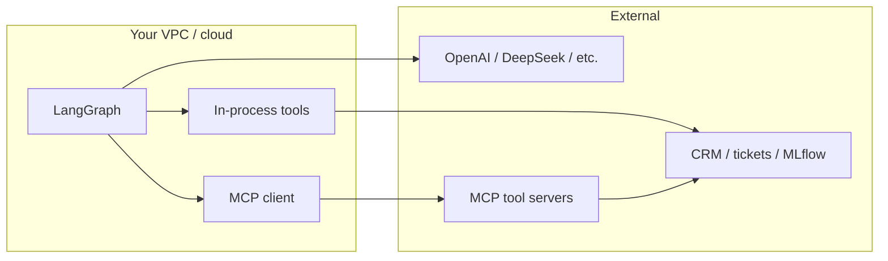

# Reference architecture

Production shapes for agent systems built from the patterns in this repo. Each diagram maps **boxes to pattern numbers** so you can trace from architecture back to runnable code.

**Related:** [single-agent vs multi-agent](../single-vs-multi-agent.md) · [LangGraph conventions](../langgraph.md) · [MCP](../mcp.md)

---

## 1. Sync chat agent (most common)

Tier-1 support bot, copilot, or internal Q&A — user sends a message, waits for a response.

| Component | Pattern(s) | This repo today |
|-----------|------------|-----------------|
| Entry API | — | CLI only; you add FastAPI/Flask |
| Router | [05 Routing](../../patterns/05-routing/) | `patterns/05-routing/example/` |
| Core loop | [01 ReAct](../../patterns/01-react/), [02 Tool Use](../../patterns/02-tool-use/) | Default in most examples |
| Grounding | [11 RAG](../../patterns/11-rag/) | Markdown KB in scenarios |
| Safety | [12 Guardrails](../../patterns/12-guardrails/) | PII checks in example |
| Risky actions | [09 HITL](../../patterns/09-human-in-the-loop/) | `interrupt()` + `--auto-approve` |
| Session state | [10 Memory](../../patterns/10-memory/) | SQLite checkpointer |
| Tool transport | [MCP](../mcp.md) | `--use-mcp` optional |

**Typical request path:** Auth → (optional route) → guardrails pre-check → graph invoke with `thread_id` → stream tokens to client → post-check → response.

**When to stop at single-agent:** Domain fits one prompt + tool set; latency budget is tight. See [single-agent vs multi-agent](../single-vs-multi-agent.md).

---

## 2. Multi-agent orchestration

Complex tickets span specialties (VPN + identity + email, or data + modeling + deploy).

| Concern | Pattern | Production note |
|---------|---------|-----------------|
| Delegation | [07 Orchestrator–Workers](../../patterns/07-orchestrator-workers/) | Worker **subgraphs** in `shared/examples/graphs/worker_subgraph.py` |
| Mid-flight transfer | [13 Handoff](../../patterns/13-handoff/) | Shared state + explicit handoff payload |
| Parallel fan-out | [06 Parallelization](../../patterns/06-parallelization/) | Workers or tool calls in parallel when independent |
| Quality gate | [08 Evaluator–Optimizer](../../patterns/08-evaluator-optimizer/) | Run on merged output before send |

**Deployment choice:** One process with compiled supervisor graph (simplest) vs. separate worker services behind a queue (scale specialists independently). Start monolithic; split when one worker dominates CPU or needs different SLAs.

**Demand-forecast fit:** Orchestrator assigns data / feature / train / deploy workers — see [scenario deployments](scenario-deployments.md#demand-forecast-ml-pipeline).

---

## 3. Event-driven (async)

Inbound email, webhooks, scheduled retrain — no user waiting on the HTTP thread.

| Component | Pattern | This repo |
|-----------|---------|-----------|
| Trigger | [15 Event-Driven](../../patterns/15-event-driven/) | `sample_event.json`, demand-forecast retrain event |
| Handler graph | 15 + nested subgraphs | `patterns/15-event-driven/example/` |
| Long tasks | [07 Orchestrator–Workers](../../patterns/07-orchestrator-workers/) | ML pipeline on retrain event |
| Human gate | [09 HITL](../../patterns/09-human-in-the-loop/) | Approve `register_model`, refunds |

**Production requirements:** Idempotent consumers, visibility timeout, DLQ, at-least-once delivery handling. Details in [production concerns](production-concerns.md).

---

## 4. Data stores (typical production)

This repo uses in-memory mocks and local SQLite. Production usually adds:

| Store | Purpose | Pattern link |
|-------|---------|--------------|
| **Checkpointer DB** (Postgres) | Threads, HITL interrupts, time travel | [09](../../patterns/09-human-in-the-loop/), [10 Memory](../../patterns/10-memory/) |
| **Vector index** | RAG retrieval | [11 RAG](../../patterns/11-rag/) — see [rag-at-scale](rag-at-scale.md) |
| **Object storage** | Raw docs, incident batches | [14 Map–Reduce](../../patterns/14-map-reduce/) |
| **MLflow / model registry** | Training runs, deployment | demand-forecast scenario |
| **Audit log** (append-only) | Tool calls, approvals | [09 HITL](../../patterns/09-human-in-the-loop/), [12 Guardrails](../../patterns/12-guardrails/) |

Examples use `data/checkpoints/langgraph.db` — swap for Postgres in production with the same checkpointer interface.

---

## 5. LLM and tool boundaries

| Approach | Use when | Repo flag |
|----------|----------|-----------|
| In-process tools | Learning, low latency, trusted code | default |
| MCP servers | Isolate tools, match Cursor/Claude Desktop | `--use-mcp` |
| Direct SaaS SDK in tools | Production integrations | Replace mocks in `shared/examples/*/tools.py` |

Never expose raw API keys to the model — tools hold credentials; the LLM only sees tool schemas and results.

---

## 6. What to build first

Minimal production slice (recommended order):

| Step | Build | Pattern |
|------|-------|---------|
| 1 | HTTP API wrapping one graph | 01 ReAct |
| 2 | Real ticket/order tools + auth | 02 Tool Use |
| 3 | Guardrails + HITL on write tools | 12, 09 |
| 4 | Postgres checkpointer + `thread_id` | 10 Memory |
| 5 | RAG over your KB | 11 RAG |
| 6 | Queue + event handler | 15 Event-Driven |

Then add routing, multi-agent, or ML orchestration only when complexity demands it.

---

## Next steps

- [Production concerns](production-concerns.md) — reliability and safety mechanics
- [Scenario deployments](scenario-deployments.md) — domain-specific component lists
- [Observability & evals](observability-and-evals.md) — operate what you deploy
