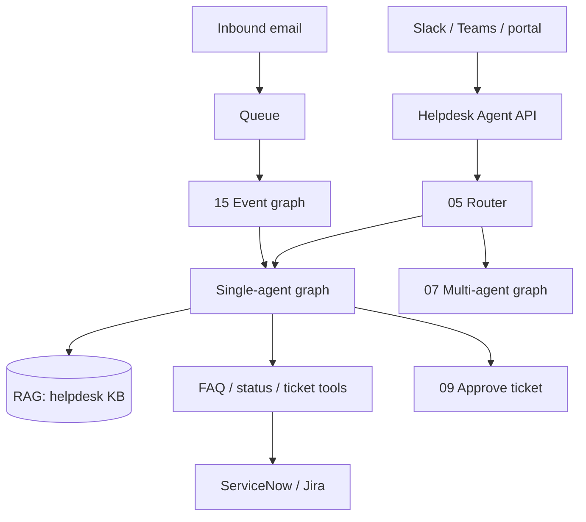
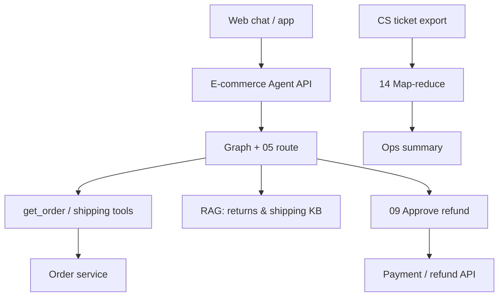
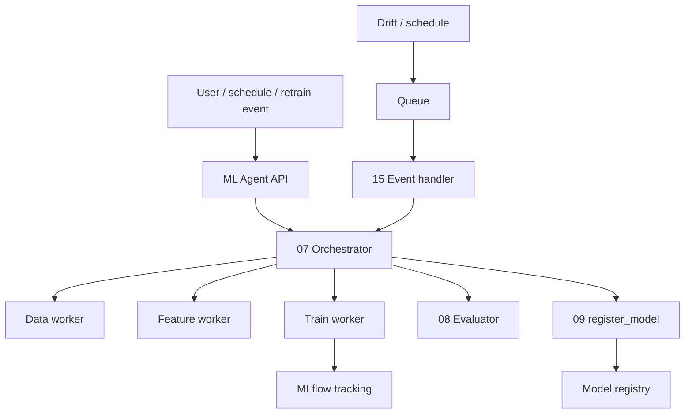

# Scenario deployments

How each **shared scenario** in this repo maps to a **production system** — components, patterns, and rollout order.

**Scenarios:** [IT Helpdesk](../../use-cases/it-helpdesk.md) · [E-commerce](../../use-cases/ecommerce-order-support.md) · [Demand Forecast](../../use-cases/demand-forecast.md)

**Related:** [reference architecture](reference-architecture.md) · [production concerns](production-concerns.md)

---

## Common platform (all scenarios)

Every scenario reuses the same platform skeleton:

| Component | Role |
|-----------|------|
| Agent API | Auth, rate limit, `thread_id`, streaming |
| LangGraph runtime | Pattern graphs from `patterns/XX/example/` |
| Checkpointer | Postgres (prod) / SQLite (dev) |
| LLM provider | OpenAI or DeepSeek (`--provider`) |
| Tool layer | In-process or MCP ([MCP](../mcp.md)) |
| Observability | Traces + audit ([observability & evals](observability-and-evals.md)) |

Switch scenario with `--scenario helpdesk|ecommerce|demand-forecast` — in production, route by product, tenant, or API key.

---

## IT Helpdesk

**Problem:** Tier-1 IT support for VPN, password, email — see [it-helpdesk.md](../../use-cases/it-helpdesk.md).



### Recommended pattern rollout

| Phase | Patterns | Production capability |
|-------|----------|---------------------|
| MVP | 01, 02, 11, 12 | Chat + FAQ RAG + PII guardrails |
| Trust | 09, 10 | Ticket approval + multi-turn |
| Scale | 05, 06 | Intent routing + parallel status checks |
| Complex | 07, 13 | VPN/identity/email specialists + Tier-2 handoff |
| Ops | 14, 15 | Incident batch reports + email webhook |

### Key integrations

| Tool (mock) | Production |
|-------------|------------|
| `search_faq` | RAG + optional live search |
| `check_vpn_status` | Network monitoring API |
| `create_ticket` | ITSM with idempotency + HITL |
| KB markdown | Confluence / SharePoint ingest |

### SLIs

- First-response latency P95
- Escalation rate to Tier-2
- HITL approval time
- Guardrail block rate (PII)

---

## E-commerce Order Support

**Problem:** Order tracking, shipping, returns, refunds — [ecommerce-order-support.md](../../use-cases/ecommerce-order-support.md).



### Recommended pattern rollout

| Phase | Patterns | Capability |
|-------|----------|------------|
| MVP | 01, 02, 11 | Order lookup + policy answers |
| Trust | 09, 12 | Refund HITL + policy guardrails |
| UX | 10, 05 | Address-change follow-ups + routing |
| Ops | 13, 14, 15 | Tier-2 exceptions + batch summaries + delay emails |

### Key integrations

| Tool (mock) | Production |
|-------------|------------|
| `get_order` | OMS / Shopify / internal orders API |
| `search_policies` | RAG over policy KB |
| `request_refund` | Payment gateway — **always** HITL |
| `create_return` | Returns portal API |

### SLIs

- Order lookup success rate
- Refund approval SLA
- Policy citation accuracy (eval)

---

## Demand Forecast ML Pipeline

**Problem:** Agentic MLDLC for SKU-store forecasting — [demand-forecast.md](../../use-cases/demand-forecast.md).



### Recommended pattern rollout

| Phase | Patterns | Capability |
|-------|----------|------------|
| MVP | 01, 02, 03 | ReAct + tools for load/train |
| Pipeline | 07, 06 | Orchestrator + parallel EDA |
| Quality | 08 | Metric gate before register |
| Governance | 09 | Human approve production register |
| Ops | 15, 13 | Scheduled retrain + specialist handoff |

### Key integrations

| Tool (mock) | Production |
|-------------|------------|
| `train_forecast_model` | Training job + MLflow |
| `register_model` | Registry with HITL |
| `generate_forecast` | Batch inference service |
| `--no-mlflow` mock | Dev/staging without MLflow server |

Run locally:

```bash
python patterns/07-orchestrator-workers/example/main.py --scenario demand-forecast --no-mlflow
```

### SLIs

- Pipeline success rate per SKU-store
- Holdout MAPE vs baseline (from MLflow)
- Time from retrain event to registered model
- HITL time on production promotion

---

## Choosing a scenario for your first deploy

| Start with | If you… |
|------------|---------|
| **helpdesk** | Want familiar chat + RAG + HITL story |
| **ecommerce** | Need clear read vs write tools and refunds |
| **demand-forecast** | Building ML ops / multi-agent orchestration |

All three use the same `shared/examples/scenarios.py` registry — production replaces mocks per scenario without changing graph topology.

---

## Cross-scenario comparison

| Dimension | Helpdesk | E-commerce | Demand forecast |
|-----------|----------|------------|-----------------|
| Primary loop | ReAct chat | ReAct chat | Orchestrator workers |
| RAG | Strong | Strong | Playbook docs |
| HITL trigger | create_ticket | request_refund | register_model |
| Async entry | Support email | Delay notification | Retrain event |
| Hardest ops concern | Escalation path | Payment idempotency | Model governance |

---

## Next steps

1. Pick scenario and MVP pattern row above.
2. Read [reference architecture](reference-architecture.md) for topology.
3. Apply [production concerns](production-concerns.md) checklist before launch.
4. Add [observability & evals](observability-and-evals.md) for your scenario’s SLIs.

Run all pattern demos for one scenario: [run-all-examples.md](../../use-cases/run-all-examples.md).
