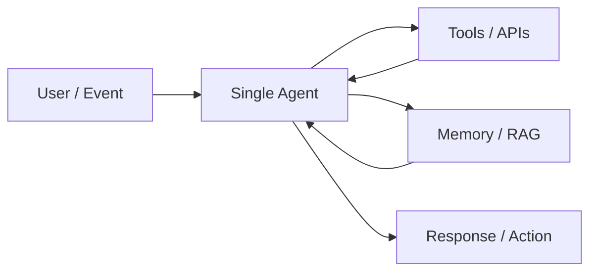
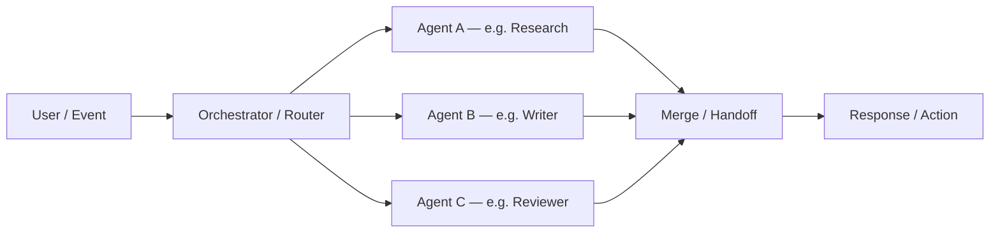

# Single-Agent vs Multi-Agent

Agentic systems are often described by **how many autonomous agents** coordinate to reach a goal. Most patterns in this repo apply to one or both models.

## Single-agent

One LLM-powered agent owns the task end to end. It may call many tools, run many prompt steps, or loop through ReAct—but there is **one decision-maker** with one system prompt (or one logical identity).

**Characteristics**

- One context thread (or one managed session)
- Simpler to debug, deploy, and observe
- Lower coordination overhead and cost
- All capabilities must fit one prompt + tool set (or one router behind the scenes)

**Typical patterns (single-agent)**

| Pattern | Role in a single-agent system |
|---------|-------------------------------|
| [ReAct](../../patterns/01-react/) | Core think → act → observe loop |
| [Tool Use](../../patterns/02-tool-use/) | How the agent affects the world |
| [Planning](../../patterns/03-planning/) | Agent decomposes its own work |
| [Prompt Chaining](../../patterns/04-prompt-chaining/) | Sequential stages, same agent identity |
| [Evaluator–Optimizer](../../patterns/08-evaluator-optimizer/) | Same agent (or same model) drafts and revises |
| [Memory](../../patterns/10-memory/) | Session and long-term state |
| [RAG](../../patterns/11-rag/) | Grounding before generation |
| [Guardrails](../../patterns/12-guardrails/) | Input/output/tool policy |
| [Human-in-the-Loop](../../patterns/09-human-in-the-loop/) | Pause before risky steps |

**Good fit when:** the domain is narrow, latency and cost matter, or a strong generalist model + tools is enough.

**Example use cases:** personal research assistant, SQL copilot, document Q&A bot, code debugger.

---

## Multi-agent

**Two or more agents** with distinct roles, prompts, or tool sets collaborate. A coordinator may assign work; agents may run in parallel or **hand off** control mid-task.

**Characteristics**

- Separation of concerns (specialist prompts and tools per agent)
- Higher complexity: state passing, handoffs, conflict resolution
- Often better for broad or multi-domain tasks
- Easier to audit *which* agent did *what*

**Typical patterns (multi-agent)**

| Pattern | Role in a multi-agent system |
|---------|-------------------------------|
| [Orchestrator–Workers](../../patterns/07-orchestrator-workers/) | Central planner delegates to specialists |
| [Handoff / Delegation](../../patterns/13-handoff/) | Transfer control and context between peers |
| [Routing](../../patterns/05-routing/) | Entry router sends work to the right specialist |
| [Parallelization](../../patterns/06-parallelization/) | Multiple agents (or workers) run at once |
| [Map–Reduce](../../patterns/14-map-reduce/) | Many workers map chunks; one reducer merges |

**Good fit when:** tasks span expertise areas, parallel speed matters, or you need clear role boundaries (e.g. “researcher” vs “writer” vs “fact-checker”).

**Example use cases:** incident response war room, software feature team (PM + dev + QA agents), sales → support escalation.

---

## Patterns that work in both

These are **cross-cutting**—they attach to single- or multi-agent setups:

- [Guardrails](../../patterns/12-guardrails/) — every agent can have guards
- [Human-in-the-Loop](../../patterns/09-human-in-the-loop/) — approve any agent’s risky action
- [Memory](../../patterns/10-memory/) — shared or per-agent memory
- [RAG](../../patterns/11-rag/) — each agent can have its own knowledge base
- [Event-Driven](../../patterns/15-event-driven/) — events can trigger one agent or a team

---

## How to choose

| Question | Lean single-agent | Lean multi-agent |
|----------|-------------------|------------------|
| Domain breadth | One clear domain | Multiple specialties |
| Team / audit needs | One owner is fine | Need “who did this?” per role |
| Latency budget | Tight | Can afford coordination |
| Failure modes | Easier to reason about one loop | Need isolation (one bad agent shouldn’t sink all) |
| Implementation time | Faster to ship | More wiring (state, handoffs) |

**Practical rule:** start **single-agent** with ReAct + tools + guardrails. Introduce **multi-agent** when you hit prompt/tool overload, need true parallelism across specialties, or require explicit delegation and handoffs.

---

## Where examples live in this repo

| Architecture | Start here |
|--------------|------------|
| Single-agent | [patterns/01-react](../../patterns/01-react/) → add tools, planning, RAG as needed |
| Multi-agent | [patterns/07-orchestrator-workers](../../patterns/07-orchestrator-workers/) + [patterns/13-handoff](../../patterns/13-handoff/) |

Each pattern’s `use-case.md` should state whether the scenario is single-agent, multi-agent, or a hybrid.
