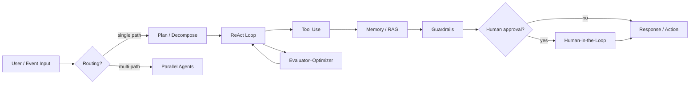

> [English](overview.md) | **বাংলা**

# প্রজেক্ট আর্কিটেকচার

## কাঠামো

```
agentic-ai-overview/
├── docs/bn/                 # বাংলা রেফারেন্স ডক
│   ├── patterns/            # প্যাটার্ন ক্যাটালগ
│   └── architecture/        # এই ফাইল — কনভেনশন
├── patterns/                # প্রতি ডিজাইন প্যাটার্নে একটি ফোল্ডার
│   └── XX-pattern-name/
│       ├── README.bn.md     # প্যাটার্ন সংজ্ঞা
│       ├── use-case.bn.md   # বাস্তব সিনারিও
│       └── example/         # চালানো যায় এমন কোড
├── shared/                  # উদাহরণ জুড়ে পুনঃব্যবহারযোগ্য কোড
├── templates/               # নতুন উদাহরণের scaffold
└── README.bn.md             # প্রজেক্ট প্রবেশ বিন্দু
```

## কনভেনশন

### প্যাটার্ন ফোল্ডার

- স্থিতিশীল ক্রমের জন্য দুই-অঙ্কের prefix (`01-react`)।
- kebab-case ফোল্ডার নাম।
- প্রতিটি প্যাটার্নে অন্তত: `README.bn.md`, `use-case.bn.md`, `example/`।

### উদাহরণ বাস্তবায়ন

- প্রতিটি উদাহরণ নিজের `example/`-এ **স্বয়ংসম্পূর্ণ** রাখুন।
- শেয়ার্ড লজিক `shared/`-এ রাখুন, ডুপ্লিকেট এড়ান।
- `example/README.bn.md`-তে prerequisites ও রান নির্দেশনা।

### শেয়ার্ড কোড

- `shared/utils/` — LLM wrapper, লগিং।
- `shared/config/` — env ও মডেল ডিফল্ট।
- প্যাটার্ন-নির্দিষ্ট লজিক `shared/`-এ রাখবেন না।

## Single-agent বনাম multi-agent

[single-vs-multi-agent.md](single-vs-multi-agent.md) — সংজ্ঞা, বেছে নেওয়ার সময়, কোন প্যাটার্ন কোথায় মানায়।

## ফ্রেমওয়ার্ক

সব runnable উদাহরণ **[LangGraph](langgraph.md)** ব্যবহার করে। ঐচ্ছিক **[MCP](mcp.md)** (`--use-mcp`) একই টুল stdio-তে দেয়।

## সাধারণ এজেন্ট ফ্লো (মানসিক মডেল)



প্রতিটি সিস্টেমে সব প্যাটার্ন থাকে না; প্যাটার্ন প্রায়ই একসাথে মিলিত হয়।
